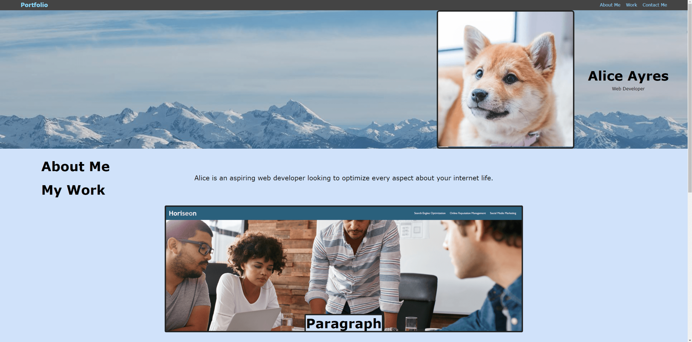

# Portfolio
## Author: Alice Ayres

## Description

This webpage was designed to display the previous work and development skills of it's creator. It has sections about her, her previous work and how to contact her for employment. 

## Visuals

## Deployment

Provided as a link here - https://neppit.github.io/Portfolio/

## Usage

To use the webpage, you can review each section by clicking on the header links at the top of the page. To inspect each element, you can open the Chrome DevTools by pressing Command+Option+I (macOS) or Control+Shift+I (Windows). A console panel should open either below or to the side of the webpage in the browser. There you can navigate to the Accessibility tab to highlight each picture element,

## Credits

- Starter Code was developed from in-class lectures. 

## License

Please refer to the LICENSE in the repo.